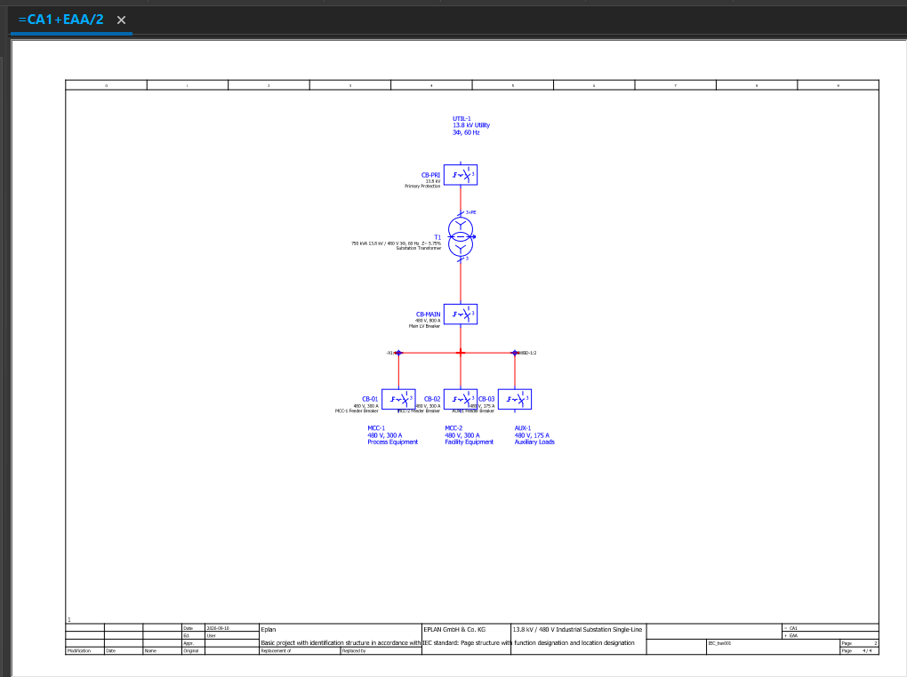
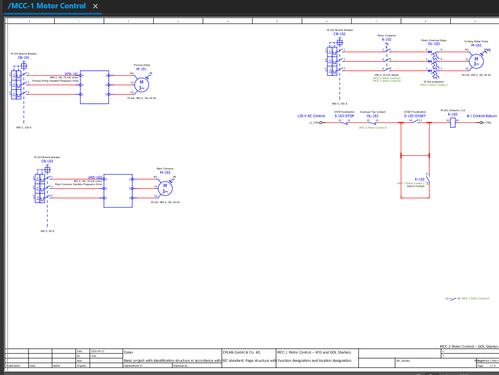
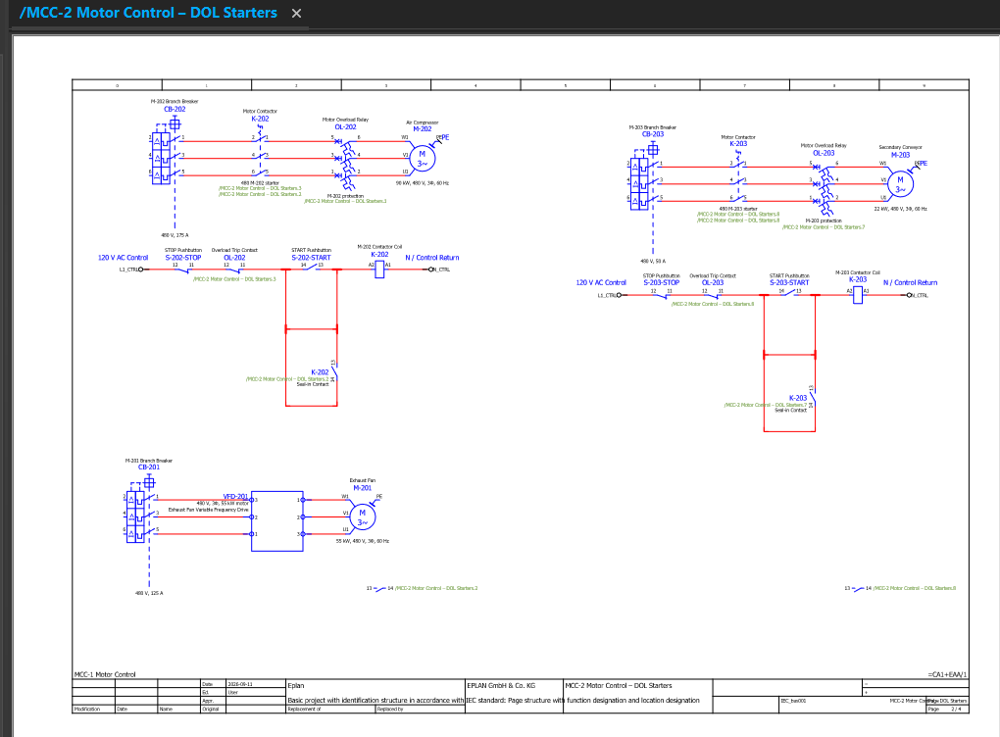
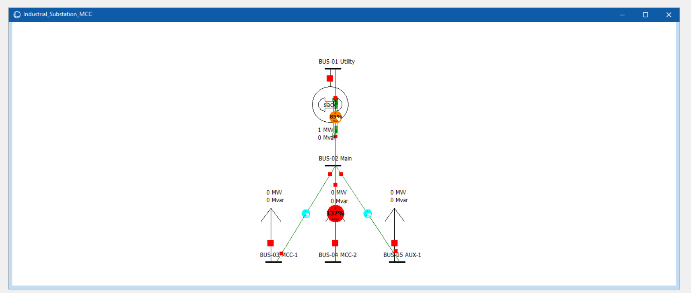

# Industrial Substation & MCC Design

## Overview

This project presents the design and analysis of a simplified industrial electrical distribution system for a food-processing and packaging facility.

The system was developed using:

- **EPLAN Education** for electrical schematics and MCC diagrams
- **PowerWorld Simulator** for power-flow analysis
- **Google Sheets** for load calculations, equipment sizing, and results comparison

The design includes a **13.8 kV utility supply**, a **750 kVA transformer**, a **480 V main switchboard**, two motor control centers, auxiliary loads, motor protection, and multiple operating scenarios.

The goal of the project was to combine electrical design, motor control, equipment sizing, and power-system analysis into one complete industrial distribution project.

---

## Project Objectives

The main objectives of this project were to:

- Design a simplified industrial substation
- Size the main transformer and feeders
- Create a 480 V distribution system
- Design MCC motor-control circuits
- Compare DOL and VFD motor applications
- Create motor protection and control schematics
- Build a PowerWorld power-flow model
- Evaluate system voltages and equipment loading
- Study different plant operating conditions
- Identify potential future expansion limitations

---

## System Architecture

The electrical system follows this structure:

```text
13.8 kV Utility
       |
Primary Protection
       |
750 kVA Transformer
13.8 kV / 480 V
       |
800 A Main Breaker
       |
480 V Main Switchboard
       |
       |--------------------|--------------------|
       |                    |                    |
     MCC-1                MCC-2                AUX-1
     300 A                300 A                175 A
```

### Main Transformer

- Rating: **750 kVA**
- Primary Voltage: **13.8 kV**
- Secondary Voltage: **480 V**
- Phase: **3-phase**
- Frequency: **60 Hz**
- Assumed Impedance: **5.75%**
- Full-load secondary current: approximately **902 A**

---

## Load Schedule

The plant contains six main motor loads and one auxiliary load.

| Tag | Equipment | Control Method | Output Power |
|---|---|---|---:|
| M-101 | Process Pump | VFD | 75 kW |
| M-102 | Cooling Water Pump | DOL | 45 kW |
| M-103 | Main Conveyor | VFD | 30 kW |
| M-201 | Exhaust Fan | VFD | 55 kW |
| M-202 | Air Compressor | DOL | 90 kW |
| M-203 | Secondary Conveyor | DOL | 22 kW |
| AUX-1 | Auxiliary Loads | Equivalent Load | 100 kVA |

### Calculated Plant Demand

Approximate calculated values:

- Real Power: **432.5 kW**
- Reactive Power: **232.6 kvar**
- Apparent Power: **491.1 kVA**
- Plant Current: **590.7 A**
- Plant Power Factor: approximately **0.88**

The selected 750 kVA transformer operates at approximately:

**65.5% loading under the initial design condition**

---

## Distribution Design

The main feeders were sized using simplified motor feeder loading assumptions and selected protective-device ratings.

| Feeder | Destination | Selected Rating |
|---|---|---:|
| FDR-MAIN | Transformer → SWBD-1 | 800 A |
| FDR-01 | SWBD-1 → MCC-1 | 300 A |
| FDR-02 | SWBD-1 → MCC-2 | 300 A |
| FDR-03 | SWBD-1 → AUX-1 | 175 A |

### Motor Branch Ratings

| Motor | Control | Selected Rating |
|---|---|---:|
| M-101 | VFD | 150 A |
| M-102 | DOL | 100 A |
| M-103 | VFD | 60 A |
| M-201 | VFD | 125 A |
| M-202 | DOL | 175 A |
| M-203 | DOL | 50 A |

These values were used as simplified portfolio design assumptions and are not intended to replace detailed construction-level electrical code calculations.

---

## EPLAN Design

EPLAN Education was used to create the electrical documentation for the system.

The drawings include:

- Substation single-line diagram
- Main switchboard
- MCC-1
- MCC-2
- DOL motor starters
- VFD motor branches
- Motor protection
- Start/stop control circuits
- Overload trip contacts
- Contactor seal-in circuits

### DOL Starter Design

The DOL motor branches follow this power structure:

```text
Breaker
   |
Contactor
   |
Overload Relay
   |
3-Phase Motor
```

The control circuit includes:

```text
120 V AC Control
      |
    STOP NC
      |
 Overload NC
      |
    START NO
      |
 Contactor Coil
      |
 Control Return
```

A normally open auxiliary contact is placed in parallel with the START pushbutton to create a seal-in circuit.

### VFD Motor Design

VFD branches use the simplified structure:

```text
Breaker
   |
   VFD
   |
3-Phase Motor
```

The VFD-controlled motors are:

- M-101 Process Pump
- M-103 Main Conveyor
- M-201 Exhaust Fan

---

## PowerWorld Model

A simplified five-bus PowerWorld model was created.

### Bus Configuration

| Bus | Description | Nominal Voltage |
|---|---|---:|
| BUS-01 | Utility | 13.8 kV |
| BUS-02 | Main Switchboard | 0.48 kV |
| BUS-03 | MCC-1 | 0.48 kV |
| BUS-04 | MCC-2 | 0.48 kV |
| BUS-05 | AUX-1 | 0.48 kV |

BUS-01 was configured as the system slack bus.

The model includes:

- Utility source
- Main transformer
- Three distribution feeders
- Aggregate MCC loads
- Auxiliary load
- Branch loading limits

The power flow was solved using the Newton-Raphson method.

The final model validated successfully with:

- **0 errors**
- **0 warnings**
- Successful power-flow convergence

---

## Operating Cases

Four operating scenarios were evaluated.

### Case 1 — Normal Operation

Normal plant loading.

Results:

- BUS-02 Voltage: **0.98126 pu**
- BUS-03 Voltage: **0.98125 pu**
- BUS-04 Voltage: **0.98125 pu**
- BUS-05 Voltage: **0.98125 pu**
- Transformer Loading: **66.7%**
- FDR-01 Loading: **75.2%**
- FDR-02 Loading: **81.9%**
- FDR-03 Loading: **69.0%**
- Utility Power: **0.43 MW**
- Utility Reactive Power: **0.25 Mvar**

---

### Case 2 — Heavy Production

Plant loading was increased to approximately 110% of normal operating conditions.

Results:

- BUS-02 Voltage: **0.97895 pu**
- BUS-03 Voltage: **0.97894 pu**
- BUS-04 Voltage: **0.97894 pu**
- BUS-05 Voltage: **0.97894 pu**
- Transformer Loading: **74.4%**
- FDR-01 Loading: **82.7%**
- FDR-02 Loading: **91.7%**
- FDR-03 Loading: **77.1%**
- Utility Power: **0.48 MW**
- Utility Reactive Power: **0.28 Mvar**

---

### Case 3 — M-202 Air Compressor Offline

The 90 kW air compressor was removed from operation.

Results:

- BUS-02 Voltage: **0.98567 pu**
- BUS-03 Voltage: **0.98567 pu**
- BUS-04 Voltage: **0.98567 pu**
- BUS-05 Voltage: **0.98567 pu**
- Transformer Loading: **50.8%**
- FDR-01 Loading: **73.7%**
- FDR-02 Loading: **37.9%**
- FDR-03 Loading: **67.9%**
- Utility Power: **0.33 MW**
- Utility Reactive Power: **0.19 Mvar**

Removing the air compressor significantly reduces loading on MCC-2 and the main transformer.

---

### Case 4 — Future Expansion

A future 110 kW motor was added to MCC-2.

Results:

- BUS-02 Voltage: **0.97636 pu**
- BUS-03 Voltage: **0.97636 pu**
- BUS-04 Voltage: **0.97636 pu**
- BUS-05 Voltage: **0.97636 pu**
- Transformer Loading: **84.5%**
- FDR-01 Loading: **74.3%**
- FDR-02 Loading: **134.1%**
- FDR-03 Loading: **69.0%**
- Utility Power: **0.55 MW**
- Utility Reactive Power: **0.32 Mvar**

This case produced the most important result in the project.

The main transformer remains within its rating at **84.5% loading**, but the MCC-2 feeder reaches **134.1% loading**.

This indicates that the existing transformer can support the additional load, but the MCC-2 feeder would need to be upgraded before the future motor could be added.

---

## Results Summary

| Metric | Case 1 Normal | Case 2 Heavy | Case 3 M-202 Offline | Case 4 Expansion |
|---|---:|---:|---:|---:|
| BUS-02 Voltage (pu) | 0.98126 | 0.97895 | 0.98567 | 0.97636 |
| BUS-03 Voltage (pu) | 0.98125 | 0.97894 | 0.98567 | 0.97636 |
| BUS-04 Voltage (pu) | 0.98125 | 0.97894 | 0.98567 | 0.97636 |
| BUS-05 Voltage (pu) | 0.98125 | 0.97894 | 0.98567 | 0.97636 |
| T1 Loading (%) | 66.7 | 74.4 | 50.8 | 84.5 |
| FDR-01 Loading (%) | 75.2 | 82.7 | 73.7 | 74.3 |
| FDR-02 Loading (%) | 81.9 | 91.7 | 37.9 | 134.1 |
| FDR-03 Loading (%) | 69.0 | 77.1 | 67.9 | 69.0 |
| Utility MW | 0.43 | 0.48 | 0.33 | 0.55 |
| Utility Mvar | 0.25 | 0.28 | 0.19 | 0.32 |

---

## Key Engineering Findings

1. **Normal operation is acceptable**

   The system operates without transformer or feeder overloads under normal operating conditions.

2. **Heavy production remains within equipment limits**

   Increased loading reduces bus voltage slightly and increases feeder loading, but all major equipment remains within its selected rating.

3. **Removing M-202 significantly reduces MCC-2 loading**

   With the 90 kW air compressor offline, FDR-02 loading drops from 81.9% to 37.9%.

4. **Future expansion creates a feeder constraint**

   Adding the future 110 kW motor increases FDR-02 loading to 134.1%.

5. **The transformer is not the limiting component**

   Even during the future expansion case, the transformer is loaded to only 84.5%.

6. **MCC-2 feeder capacity is the main expansion limitation**

   Future expansion on MCC-2 would require feeder and protection upgrades before the additional motor is installed.

---

## Results Graphs

### Main Bus Voltage


Bus voltage remained close to nominal across all operating conditions. The highest voltage occurred when M-202 was offline, while the lowest voltage occurred during the future expansion scenario.

### Transformer and Feeder Loading


The future expansion scenario causes FDR-02 to exceed its selected rating, reaching 134.1% loading.

### Utility Power Demand


Utility demand is lowest when M-202 is offline and highest during the future expansion scenario.

---

## Project Screenshots

### Substation Single-Line Diagram



### MCC-1



### MCC-2



### PowerWorld Model



---

## Software Used

### EPLAN Education

Used for:

- Single-line diagrams
- Motor control schematics
- MCC design
- Protection devices
- Control wiring

### PowerWorld Simulator

Used for:

- Power-flow modeling
- Bus-voltage analysis
- Transformer loading
- Feeder loading
- Operating-case comparison

### Google Sheets

Used for:

- Motor calculations
- Transformer sizing
- Feeder sizing
- Load schedules
- Power calculations
- Results tables
- Graphs

---

## Repository Structure

```text
Industrial-Substation-MCC-Design/
│
├── README.md
│
├── docs/
│
├── eplan/
│   └── EPLAN project files
│
├── powerworld/
│   ├── Industrial_Substation_MCC.pwb
│   └── Industrial_Substation_MCC.pwd
│
├── results/
│   ├── bus-voltage-chart.png
│   ├── equipment-loading-chart.png
│   ├── utility-demand-chart.png
│   └── Stage_8_9_Results.xlsx
│
└── screenshots/
    ├── eplan-single-line.png
    ├── mcc-1-schematic.png
    ├── mcc-2-schematic.png
    └── powerworld-oneline.png
```

---

## Engineering Conclusion

The completed design demonstrates the integration of industrial power distribution, motor control, equipment sizing, and power-flow analysis.

The original plant configuration operates within the selected transformer and feeder ratings under both normal and heavy-production conditions.

The PowerWorld study also demonstrates how equipment outages and future expansion affect the distribution system.

The most important design finding occurs during the future expansion scenario. Although the 750 kVA transformer remains within its rating at 84.5% loading, the MCC-2 feeder reaches 134.1% loading.

Therefore, the existing transformer has sufficient capacity for the proposed expansion, but the MCC-2 feeder and associated protection would need to be upgraded before the additional 110 kW motor could be connected.

This project provided practical experience with:

- Industrial power distribution
- Motor control
- MCC design
- Transformer and feeder sizing
- Electrical schematic development
- Power-flow simulation
- Operating-scenario analysis
- Engineering documentation
